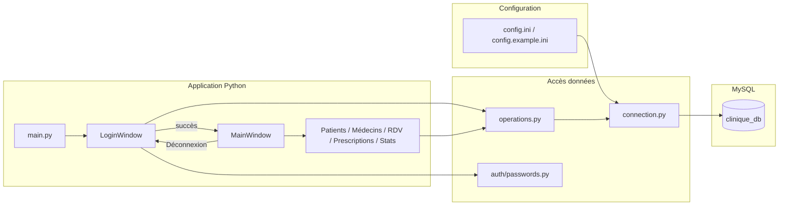
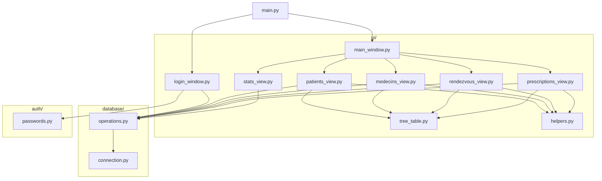
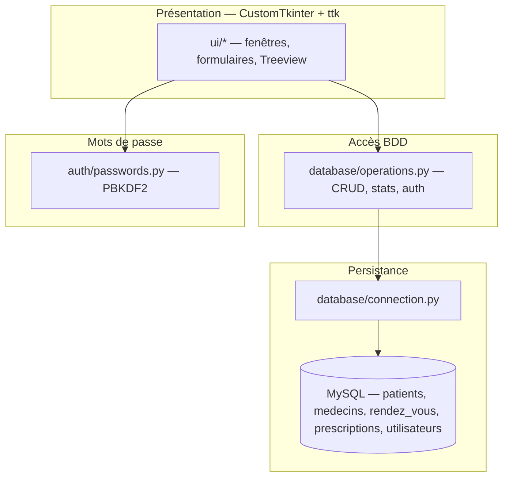

# Gestion d'une clinique

Application desktop **Python 3.10+**, interface **CustomTkinter**, base **MySQL 8.x** via **mysql-connector-python** (projet académique).

## Prérequis

- Python 3.10 ou supérieur
- Serveur MySQL 8.x (WAMP, XAMPP, MySQL Server, etc.)

## Installation

```bash
pip install -r requirements.txt
```

## Configuration MySQL

1. Créez la base et les tables : exécutez le script `sql/schema.sql` (phpMyAdmin, MySQL Workbench ou ligne de commande).

   Si votre base **existait déjà** sans la table des comptes, exécutez aussi `sql/migration_add_utilisateurs.sql` (crée la table et le compte démo).

2. Copiez `config.example.ini` vers `config.ini` et renseignez `user`, `password`, `host`, `database` :

```ini
[mysql]
host = localhost
port = 3306
user = root
password = votre_mot_de_passe
database = clinique_db
```

Ne commitez pas `config.ini` (déjà ignoré par `.gitignore`).

## Lancement

À la racine du projet :

```bash
python main.py
```

Une fenêtre de **connexion** s’affiche en premier. Compte de démonstration (à documenter pour la soutenance, **pas** pour un vrai déploiement) :

| Champ | Valeur |
|--------|--------|
| Identifiant | `admin` |
| Mot de passe | `admin123` |

Le mot de passe est stocké en base sous forme de **hash PBKDF2-HMAC-SHA256** avec sel (`auth/passwords.py`, 150 000 itérations). Aucun mot de passe en clair dans le code source.

Bouton **Déconnexion** dans la barre latérale : retour à l’écran de connexion.

## Fonctionnalités (cahier des charges)

- CRUD pour **Patients**, **Médecins**, **Rendez-vous**, **Prescriptions** (tableaux `ttk.Treeview`, scrollbars, confirmations de suppression).
- **Recherche** dynamique, **tri** par clic sur les en-têtes de colonnes, **export CSV** (données affichées) sur chaque module liste.
- Écran **Statistiques** (comptages, moyenne de durée des prescriptions).
- Requêtes SQL **paramétrées** ; paramètres de connexion **externalisés**.
- **Authentification** (connexion + déconnexion), mots de passe hachés en MySQL.

## Structure du dépôt

- `main.py` — entrée (boucle connexion → application)
- `auth/` — hachage PBKDF2 (stdlib)
- `database/` — connexion et requêtes
- `ui/` — login, fenêtre principale, vues par entité, composant tableau
- `sql/schema.sql` — schéma + données de test + compte démo
- `sql/migration_add_utilisateurs.sql` — ajout auth sur une base déjà créée

## Architecture (diagrammes)

Les diagrammes ci-dessous utilisent la syntaxe [Mermaid](https://mermaid.js.org/) : ils s’affichent **directement sur la page GitHub** du dépôt ; en local, utilisez une prévisualisation Markdown compatible (VS Code + extension Mermaid, ou [mermaid.live](https://mermaid.live)).

### Flux d’exécution



### Modules et dépendances



### Couches (vue synthétique)



## Contrôle manuel (avant soutenance)

À vérifier une fois la base importée et `config.ini` renseigné :

- **Patients** : ajout avec champs vides (message d’erreur) ; doublon de **n° dossier** ou **email** (message MySQL clair) ; modification puis suppression (avec RDV existant : refus si FK).
- **Médecins** : email dupliqué ; suppression d’un médecin lié à un RDV (refus).
- **Rendez-vous** : même créneau pour le même médecin (contrainte `UNIQUE`) ; recherche / tri / export CSV sur les lignes filtrées.
- **Prescriptions** : durée ≤ 0 refusée ; export après filtre.
- **Statistiques** : bouton « Actualiser » après ajout de données.
- **Connexion** : mauvais mot de passe ; identifiant inconnu ; après migration, vérifier que la table `utilisateurs` existe.
